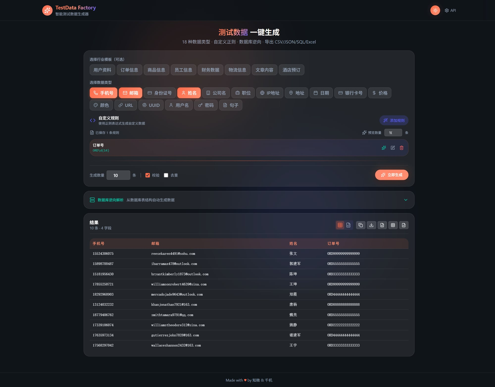

# TestData Factory

<p align="center">
  
  
  
  
</p>

智能测试数据生成器 - 测试同学的效率工具

## 功能特性

### 🎯 核心能力
- **18 种内置数据类型**：手机号、身份证、邮箱、IP、地址、日期、银行卡号、价格、颜色、URL、UUID、用户名、密码、姓名、公司名、职位、年龄、性别
- **8 个行业模板**：用户资料、订单信息、商品信息、员工信息、财务数据、物流信息、文章内容、酒店预订
- **自定义正则规则**：支持自定义正则表达式，灵活生成各种格式数据
- **数据校验和去重**：保证生成数据的正确性和唯一性
- **批量生成**：支持 1-10000 条数据生成
- **多格式导出**：CSV、JSON、Excel、SQL

### 🎨 UI 特性
- **双主题模式**：深色/亮色主题一键切换
- **Glassmorphism 设计**：现代科技风界面
- **珊瑚粉渐变按钮**：统一的视觉风格
- **响应式布局**：适配不同屏幕尺寸

### 🔌 API 能力
- 完整的 RESTful API
- OpenAPI 文档自动生成
- 支持 CORS 跨域

## 快速开始

### 后端启动

```bash
# 进入项目目录
cd testdata-factory

# 安装依赖
pip install -e .

# 启动后端 (默认端口 8003)
uvicorn testdata_factory.api:app --host 0.0.0.0 --port 8003 --reload

# 或使用 Python 直接运行
python -m testdata_factory.api
```

### 前端启动

```bash
# 进入前端目录
cd web

# 安装依赖
npm install

# 启动开发服务器 (默认端口 5173)
npm run dev
```

访问 `http://localhost:5173/` 即可使用。

### 使用 CLI

```bash
# 生成 10 个手机号和邮箱
testgen generate -c 10 -t phone -t email

# 使用行业模板
testgen user-profile -c 50

# 导出到文件
testgen generate -c 100 -t phone -t email -o output.csv

# 查看可用模板
testgen templates

# 查看帮助
testgen --help
```

## API 调用示例

```bash
# 生成混合数据（内置类型 + 自定义正则）
curl -X POST http://localhost:8003/api/generate \
  -H "Content-Type: application/json" \
  -d '{
    "count": 10,
    "types": ["phone", "email"],
    "custom_rules": [
      {"name": "订单号", "pattern": "ORD\\\\d{14}"}
    ]
  }'

# 使用行业模板
curl -X POST http://localhost:8003/api/industry/generate \
  -H "Content-Type: application/json" \
  -d '{
    "template": "user_profile",
    "count": 10
  }'

# 导出数据
curl -X POST http://localhost:8003/api/export \
  -H "Content-Type: application/json" \
  -d '{
    "data": [...],
    "format": "csv"
  }'
```

## 项目结构

```
testdata-factory/
├── src/
│   └── testdata_factory/
│       ├── api.py              # FastAPI 主入口
│       ├── generators/         # 数据生成器
│       │   ├── phone.py
│       │   ├── email.py
│       │   ├── regex.py        # 正则生成器
│       │   └── ...
│       ├── routers/            # API 路由
│       │   └── generator.py
│       └── templates.py        # 行业模板
├── web/                        # React 前端
│   ├── src/
│   │   ├── App.tsx
│   │   ├── App.css
│   │   └── index.css
│   └── package.json
├── docs/                       # 文档
│   └── usage.md               # 使用说明
└── README.md
```

## 技术栈

- **后端**：Python 3.10+ + FastAPI + Faker
- **前端**：React 18 + TypeScript + Tailwind CSS
- **数据库**：SQLAlchemy (支持 PostgreSQL/MySQL/SQLite)

## 预览

### 界面展示

**深色主题**


**亮色主题**


### 功能演示

1. **选择数据类型**
   - 支持 18 种内置数据类型
   - 可多选组合

2. **使用行业模板**
   - 8 个预设模板
   - 一键生成完整数据集

3. **自定义规则**
   - 正则表达式支持
   - 灵活定义数据格式

4. **数据去重**
   - 自动去重
   - 保证数据唯一性

5. **多格式导出**
   - CSV / JSON / Excel / SQL
   - 支持复制和下载

## 更新日志

### v1.0.0 (2026-03-17)
- ✨ 新增 18 种数据类型
- ✨ 新增 8 个行业模板
- ✨ 新增自定义正则规则
- ✨ 新增数据去重功能
- ✨ 新增多格式导出
- 🎨 统一深色主题按钮样式
- 🐛 修复正则表达式生成器
- 🐛 修复 CORS 配置

## 贡献指南

欢迎提交 Issue 和 Pull Request！

## License

MIT License - Made with ♥ by 知微 & 千机
